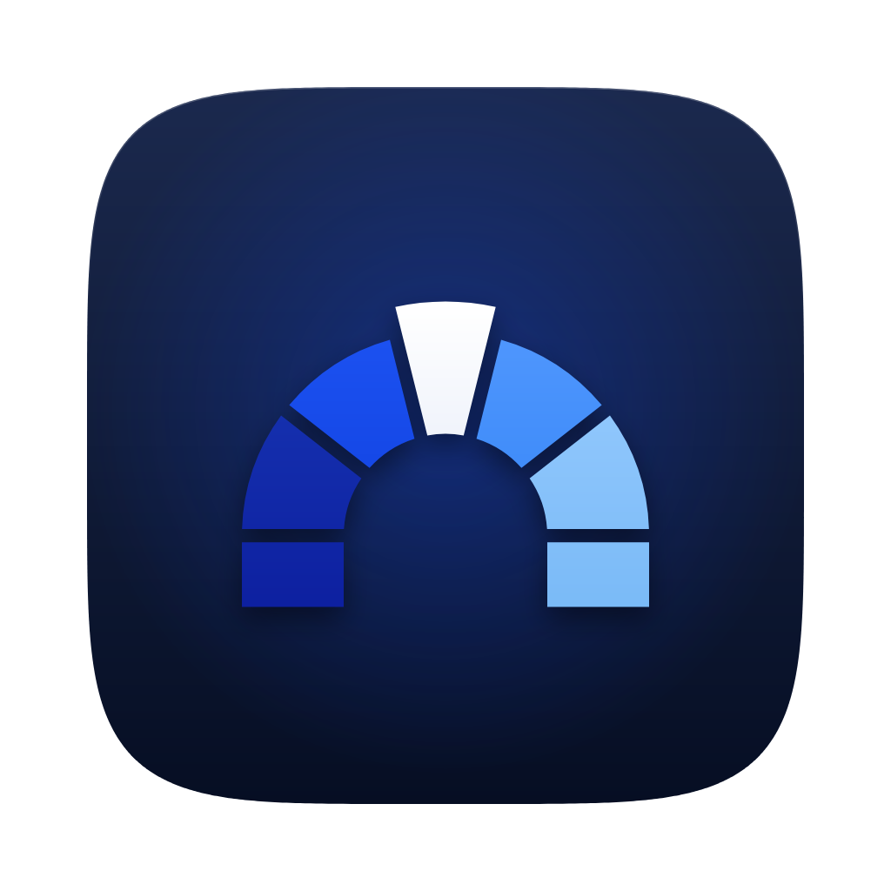

<p align="center">
  
</p>

<h1 align="center">
  <picture>
    <source media="(prefers-color-scheme: dark)" srcset="branding/svg/lockup-dark.svg">
    
  </picture>
</h1>

<p align="center">A desktop home for <a href="https://rclone.org">rclone</a>: your computer and every cloud, side by side.</p>

<p align="center">
  <a href="https://github.com/Pimzino/arcus/actions/workflows/ci.yml"></a>
  <a href="https://github.com/Pimzino/arcus/releases/latest"></a>
  <a href="https://github.com/Pimzino/arcus/releases"></a>
  
  <a href="LICENSE"></a>
  <a href="https://rclone.org"></a>
</p>

Arcus is a desktop app for [rclone](https://rclone.org), the tool that talks to more than 70 cloud storage
providers. It puts your computer and your remotes in two panes, and copies, syncs, moves and mounts between
them with live progress. It downloads and verifies the official rclone binary itself and drives it through
rclone's remote-control API, so anything rclone can do is within reach, including from its built-in console.

*Arcus* is Latin for arch: two sides and the structure that joins them.

## Download

Get the latest version from the [releases page](https://github.com/Pimzino/arcus/releases/latest):

| Platform | File |
| --- | --- |
| macOS, Apple Silicon | `Arcus_<version>_aarch64.dmg` |
| macOS, Intel | `Arcus_<version>_x64.dmg` |
| Windows 10/11 | `Arcus_<version>_x64-setup.exe` (or the `.msi`) |

The builds are not code-signed yet, so the system warns the first time:

* **macOS:** open Arcus once, then go to System Settings → Privacy & Security and click *Open Anyway*. If macOS
  says the app is damaged, run `xattr -dr com.apple.quarantine /Applications/Arcus.app` and open it again.
* **Windows:** SmartScreen shows *Windows protected your PC*; click *More info*, then *Run anyway*.

On first launch Arcus downloads rclone and checks its signature, which takes a few seconds. Mounting a remote
as a drive also needs [macFUSE](https://macfuse.github.io/) or [FUSE-T](https://www.fuse-t.org/) on macOS, or
[WinFsp](https://winfsp.dev/) on Windows.

### Upgrading from Rclone GUI

Arcus was called *Rclone GUI* up to v0.5.1. Install Arcus as usual; nothing needs to be exported or copied.
Your settings, downloaded rclone versions, transfer history and logs stay where they are and Arcus picks
them up, because they are stored under the app's identifier, `com.rclonegui.desktop`, which did not change.
Your rclone config is rclone's own file and is not touched either.

* **Windows:** both installers replace Rclone GUI, including its Start menu shortcut.
* **macOS:** dragging Arcus into Applications leaves the old *Rclone GUI* app next to it. The first time Arcus
  starts, it offers to move the old app to the Trash. If you kept Rclone GUI in the Dock, swap it for Arcus.
  macOS may ask for Full Disk Access again, and the permissions guide in the app shows where.

## Features

* **Dual-pane explorer** for remotes and local disks. Keyboard-driven (arrows, Shift to select a range,
  type-to-select, F5/F6 copy/move, F2 rename, ⌘⌫ delete, ⌘L to edit the path), drag and drop between panes
  (hold ⌥ to move), right-click menus, public links, folder sizes and storage usage. Google Drive's same-named
  files are handled one at a time and can be copied, moved and renamed by their ID.
* **Remotes** for every rclone backend, with forms built from rclone's own option metadata, and a browser
  sign-in step for OAuth providers such as Google Drive, OneDrive, Dropbox and Box.
* **Transfers:** copy, sync, move, bisync and check, with dry run, filters, bandwidth limits, parallelism and
  more. Live per-file progress and ETA, what a job is busy with when the numbers stand still, a list of
  everything it did, and re-runs as they were, as another operation or with changes.
* **A log per transfer.** Each transfer runs in an rclone of its own and keeps that rclone's log, cleaned up
  after 30 days by default.
* **Mounts** with VFS cache settings.
* **Console:** run any rclone command with streamed output, or call any rc method with JSON parameters.
* **Show in Finder / File Explorer** for anything on this computer the app shows. Files are revealed in their
  folder, never launched.
* **macOS permissions guide** for Full Disk Access, the protected folders, FUSE and the local network.
* **Verified rclone:** the official binary, checked against rclone's PGP-signed checksums and kept private to
  the app. Pin a version or use your own binary, and edit any global rclone option, in Settings.

## How it works

```
┌──────────────────────────────── Arcus (Tauri 2) ───────────────────────────────┐
│  React / TypeScript UI                      Rust core                          │
│  explorer · remotes · transfers · mounts    provisioning (download + verify)   │
│  console · settings                         daemon supervisor (rclone rcd)     │
│            ▲ invoke / events ▲              rc HTTP client (loopback only)     │
└────────────┼─────────────────┼─────────────────────────┬───────────────────────┘
             └─────────────────┘                         │ http://127.0.0.1:<random port>
                                                         ▼
                                     rclone rcd  (official binary, app-private copy)
                                     ── uses your normal rclone.conf ──
```

* **Provisioning.** On first launch the app resolves the latest stable version
  (`downloads.rclone.org/version.txt`), fetches that release's `SHA256SUMS`, verifies its
  PGP clear-signature against the rclone release keys compiled into the app (pinned by
  fingerprint, see `src-tauri/keys/`), cross-checks the checksum with the digest GitHub
  publishes for the same asset, downloads the zip while hashing it, compares the SHA-256,
  extracts only the executable into the app's data folder and runs `rclone version` to
  confirm. Any mismatch aborts the install. Nothing is installed system-wide.
* **Daemon.** The app starts `rclone rcd` on a random loopback port with random
  credentials passed through the environment (not on the command line), logs to a file,
  keeps remotes connected for an hour after their last use, and shuts it down when the app
  quits. A daemon left behind by a crash is asked to quit on the next start. rclone runs
  every rc call as a job, listings and progress polls included, and keeps its result in
  memory until it expires, after an hour by default (Settings → Daemon). The window keeps
  polling running jobs while it is hidden (`backgroundThrottling` in `tauri.conf.json`), so
  their results are read before they expire.
* **One rclone per transfer.** That daemon serves the UI: browsing, remotes, mounts, the
  console and quick actions such as deleting or renaming a folder. Every transfer runs in a
  short-lived `rclone rcd` of its own. rclone has no event API: that a job is creating folders,
  which file failed and why, or what a dry run would change only shows in its log, and log
  lines do not say which job wrote them. A transfer's own rclone logs JSON to stderr, which
  the app reads to show what the job is doing, and writes out as a readable log file by
  default; Settings → Transfers & logs, or the transfer dialog for one job, switches that off.
  rclone's bandwidth limit is per process too, so it covers that transfer alone. Global options
  applied for the session are given to each transfer's rclone as it starts.
* **Everything else is the rc API.** Listing, copy/sync/move/bisync/check, per-job
  progress (`core/stats`), remote configuration (`config/providers` + the non-interactive
  `config/create` state machine, including browser-based OAuth), mounts, global options
  (`options/info`), and a console that can run *any* rclone command (`core/command`) or
  rc method. New rclone features therefore appear without app changes.
* **Config.** By default the daemon uses rclone's own config file, so remotes you set up
  with the rclone CLI show up in the app and vice versa. A different file can be chosen in
  Settings.

## Design and brand

The look follows rclone's own built-in web GUI — [rclone-web](https://github.com/rclone/rclone-web),
the interface `rclone gui` serves — so the two front ends read as the same product: its oklch
colour tokens for the light and dark themes (switched with `data-theme` on `<html>`, defined in
`src/index.css`), zero corner radius, 14px UI text, and its button, input, card, table,
empty-state and dialog patterns ported as class recipes into the hand-built components in
`src/components/ui/`. There is still no component library: Tailwind is only the utility-CSS
layer, and the icons come from Lucide. The desktop chrome a browser tab has no use for stays:
the left sidebar (⌘1–5 switch pages, ⌘, opens Settings), the status bar along the bottom of
the window, and the dual-pane explorer. ⌘N starts a transfer on the Transfers page.

A status bar along the bottom of the window keeps rclone's state in sight: the daemon's
state, version, remote-control address and process id (with its start/stop/restart menu and
log) on the left, and on the right how many transfers are running, their combined progress,
speed and ETA, plus a count of the jobs that need attention. It reuses the statistics the
transfer list already polls, so it costs no extra rc calls.

The mark is an arch of five stones that step from deep to light blue, the way files cross from one pane to
the other, held together by its keystone: the part rclone plays here. All branding lives in [`branding/`](branding/): the app icon master (`app-icon.png`) and every platform icon
made from it (`icons/`, which `tauri.conf.json` points the bundle at), the mark, wordmark, lockups and favicon as
SVG (`svg/`), the typeface (`fonts/`: Sora, under the SIL Open Font License, plus the Latin subset the app uses
for its large headings) and `brand-sheet.png`. One script, `branding/build.py`, draws all of it from the
geometry and colours at its top, and also writes the React components the app draws its logo with
(`src/components/app/Brand.tsx`). To change the brand, edit the script and run it:

```bash
python3 -m venv .venv-brand && .venv-brand/bin/pip install skia-python fonttools
.venv-brand/bin/python branding/build.py
```

The wordmark's typeface, Sora SemiBold, is used for page, section and dialog titles only. All other
text is in the system font (SF Pro on macOS, Segoe UI on Windows), which reads better at small sizes and in
dense tables and keeps the app native on each platform.

## Development

Prerequisites: Node 20+, Rust stable, and the platform toolchain Tauri needs
(macOS: Xcode command line tools; Windows: Visual Studio Build Tools with the C++ workload
and WebView2, which is preinstalled on Windows 10/11). See
<https://tauri.app/start/prerequisites/>.

```bash
npm install
npm run tauri dev        # desktop app with hot reload
npm run tauri build      # release bundles in src-tauri/target/release/bundle
npm run typecheck        # TypeScript
npm run test:rust        # Rust unit tests (incl. signature verification fixture)

# Live end-to-end provisioning test: downloads and verifies the current release
# into a temp dir (needs network).
cargo test --manifest-path src-tauri/Cargo.toml -- --ignored provision_live --nocapture
# Live transfer test: runs real copies through a transfer's own rclone and
# checks the activity and the log file. Needs an rclone binary; the one the
# app installed will do (macOS: ~/Library/Application Support/
# com.rclonegui.desktop/bin/<version>/rclone).
RCLONE_GUI_TEST_BINARY=/path/to/rclone cargo test --manifest-path src-tauri/Cargo.toml -- --ignored live_transfer --nocapture
```

### Developing the UI in a browser

The UI can run in a normal browser against a standalone daemon, which is convenient for
front-end work. Start rclone yourself and put the connection in `.env.local`
(git-ignored):

```bash
rclone rcd --rc-addr 127.0.0.1:5572 --rc-user dev --rc-pass dev
```

```ini
# .env.local
RCLONE_DEV_RC=http://127.0.0.1:5572
RCLONE_DEV_RC_AUTH=dev:dev
VITE_DEV_HOME=/Users/you
```

Then `npm run dev` and open <http://localhost:1420>. Provisioning and daemon control are
simulated by `src/lib/devShim.ts` in this mode; rc calls are real. Transfers all run on that one
daemon, whose log the browser cannot read, so their activity is made up from the files
`core/transferred` reports as finished. To see anything else, report it from the console:
`__rcloneGuiShim.activity("<the job's daemonId>", "folderCreated", "Photos/2024")`.

### macOS permissions

macOS attributes everything rclone does to the app that started it, so the app asks for
the permissions on rclone's behalf: Full Disk Access (recommended, granted manually in
System Settings → Privacy & Security), the per-folder prompts for Desktop, Documents and
Downloads (the app can trigger them on request), a FUSE layer for mounts and the
local-network prompt. The guide is shown once on first run and stays available under
Settings → macOS permissions. Grants are tied to the app's code signature: a local build
that is not signed with a Developer ID is ad-hoc signed with a hash that changes every
build, so expect to grant Full Disk Access again after rebuilding.

### Project layout

```
src/                      React UI
  components/ui/          hand-built design system primitives
  components/app/         app-level pieces: sidebar, status bar, location bar/picker, transfer dialog, log viewer,
                          Brand.tsx (the logo, generated by branding/build.py)
  lib/tauri.ts            invoke/listen bridge and typed command wrappers
  lib/rc.ts               typed helpers over the rclone rc API
  lib/paths.ts            "location" model: { fs, path } for remotes and local disks
  lib/fileManager.ts      showing a path in Finder / File Explorer / the Linux file manager
  store/                  app state, tracked jobs (with 1 s polling), explorer panes
  pages/                  Setup, Permissions (macOS guide), Explorer, Remotes (+ wizard), Transfers, Mounts, Console, Settings
src-tauri/src/
  rclone/provision.rs     download → PGP verify → GitHub cross-check → SHA-256 → extract → probe
  rclone/verify.rs        pinned keyring and clear-signature verification (unit-tested)
  rclone/daemon.rs        rclone rcd lifecycle (main daemon)
  rclone/transfers.rs     the rclone rcd each transfer runs in
  rclone/activity.rs      a transfer's JSON log → activity events for the UI + its readable log file
  rclone/rc.rs            loopback HTTP client (JSON + streaming)
  commands.rs             the Tauri command surface used by the UI
  macos.rs                macOS privacy (TCC) checks, FUSE detection, System Settings links, pre-rename app clean-up
src-tauri/keys/           rclone release signing keys (verbatim copy of rclone.org/KEYS)
src-tauri/windows/        NSIS installer hooks (replacing a pre-rename Rclone GUI install)
scripts/release.mjs       cuts a release: version bump, CHANGELOG.md section, tag (see Releases)
branding/                 logo, icons, fonts and the script that draws them (see Design and brand)
.github/workflows/        ci.yml (tests), release.yml (bundles for a tag), windows-upgrade.yml
```

### Where data lives

| | macOS | Windows |
| --- | --- | --- |
| rclone binaries, settings, job history | `~/Library/Application Support/com.rclonegui.desktop/` | `%APPDATA%\com.rclonegui.desktop\` |
| app + daemon logs | `~/Library/Logs/com.rclonegui.desktop/` | `%LOCALAPPDATA%\com.rclonegui.desktop\logs\` |
| rclone config | rclone's default (`rclone config file`) unless overridden in Settings | same |

## Continuous integration and releases

Three workflows in `.github/workflows/`:

* **`ci.yml`** runs on every push to `main` and every pull request: the TypeScript type check, the UI's unit
  tests (`npm test`) and the Rust tests. The *tests* badge above is its latest result on `main`.
* **`release.yml`** runs for a version tag: `ci.yml` first, then it drafts a GitHub release whose notes are
  that version's changelog section, builds the macOS (Apple Silicon and Intel) and Windows bundles, attaches
  the `.dmg`, `.msi` and setup `.exe` files and publishes the release. If a bundle fails to build, the release
  stays a draft, and re-running the failed jobs finishes it. It refuses a tag that doesn't match the version
  recorded in the files.
* **`windows-upgrade.yml`**, run by hand from the Actions tab, installs a published release on a Windows
  runner, installs the current commit over it with each installer, and checks that the old install is gone
  and the user's data survived. Run it whenever the installer settings change. The MSI's
  `upgradeCode` in `tauri.conf.json` is the one Tauri derived from the old name, *Rclone GUI*: it must stay
  as it is, or MSI installs stop upgrading.

Releases are cut on request, from an up-to-date `main` with nothing uncommitted:

```bash
npm run release -- patch             # 0.1.0 -> 0.1.1; or minor, major, or a version such as 1.0.0
npm run release -- minor --dry-run   # show the next version and its changelog without changing anything
```

The command sets the new version in `package.json`, `package-lock.json`, `src-tauri/tauri.conf.json`,
`src-tauri/Cargo.toml` and `src-tauri/Cargo.lock` (the app reports the Cargo version), adds a section to
[`CHANGELOG.md`](CHANGELOG.md) listing every commit since the previous release with a link to its commit ID,
commits that as "Release vX.Y.Z", tags the commit and pushes the commit and the tag together. A version that
has never been released can be released as it is by naming it, e.g. `npm run release -- 0.1.0`.

## Code signing

The release builds are unsigned for macOS (Apple Silicon and Intel) and Windows. To sign them, set the
`APPLE_*` secrets used in `.github/workflows/release.yml` for macOS signing and notarization (the build
passes them to Tauri only once `APPLE_CERTIFICATE` is set, so unsigned builds keep working until then), and
add a Windows code-signing certificate following <https://tauri.app/distribute/>.

## Roadmap

* Scheduled/recurring transfers and a system-tray mode
* `rclone serve` management (SFTP/WebDAV/HTTP/… servers) from the UI
* Drag and drop from Finder/Explorer into a pane
* App auto-update via the Tauri updater plugin
* Bisync session helpers (resync prompts, listing history)

## Credits

Arcus would be nothing without [rclone](https://rclone.org) ([source on
GitHub](https://github.com/rclone/rclone)), created by Nick Craig-Wood and maintained by its
contributors. Every listing, transfer, sync and mount in this app is rclone's work; Arcus only
drives the official binary through its remote-control API. If Arcus is useful to you, consider
[supporting rclone](https://rclone.org/sponsor/). The app says the same under Settings → About.

Arcus is an independent project, not affiliated with or endorsed by the rclone project. Its look
follows rclone's own web GUI, [rclone-web](https://github.com/rclone/rclone-web).

## Licence

Arcus is free software under the GNU General Public License v3.0; see [LICENSE](LICENSE). rclone itself is
MIT-licensed and is downloaded, not bundled. Sora, the wordmark's typeface, is under the SIL Open Font License
(`branding/fonts/OFL.txt`).
